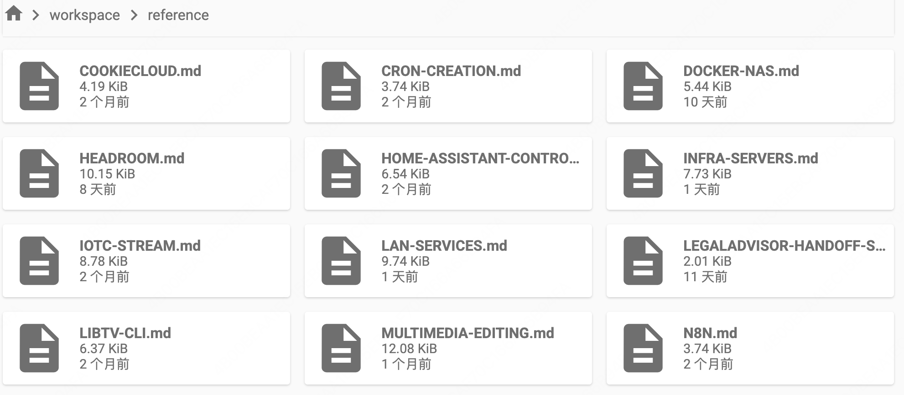
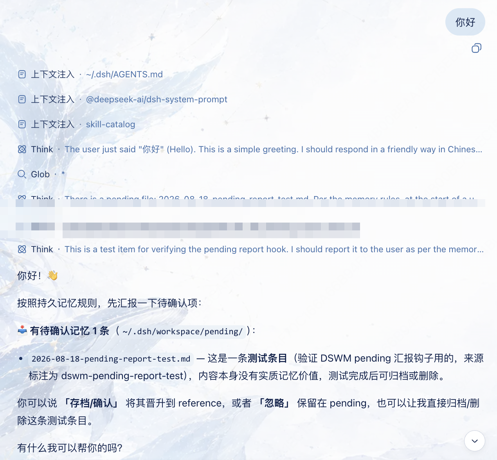

# DSWM — Simple Wiki Memory for DeepSeek Harness

A super-simplified LLM-wiki memory plugin: one index document (auto-loaded) + one markdown file per topic (read only when needed) — no dumping everything into the context and burning tokens. Simple and lightweight, painless to install/uninstall, and freely editable however you like.

A self-maintaining persistent memory system for [DeepSeek Harness](https://github.com/deepseek-ai/deepseek-harness) (DSH). Built on the native `dsh-agent-instructions` (AGENTS.md) mechanism — no RAG, no vector DB, no LLM calls at runtime. Just Markdown + git.

> 简体中文（默认）见 [README.md](README.md) · English: this file.

## Overview — what problem does this solve?

**Long-term memory without the token tax.** If you dump all your memory into the prompt, a large memory costs a fortune in tokens every session. DSWM loads only the **index** (small, auto-injected every session); the actual topic files are read **on demand** when a task needs them.

**Lightweight, no heavy machinery.** LLM-Wiki-style systems are powerful but heavy and hard to maintain — overkill for most users. DSWM's entire memory is plain Markdown files: edit them by hand, or let the agent edit them. What you see is what you get.

**Shared across harnesses.** Long-term memory should belong to you, not to one harness. DSWM's memory is plain `.md` files that any harness can consume — to reuse the same memory in another tool, just point that tool's `AGENTS.md` (or equivalent) at it.

## What it does

Every session, DSH auto-injects `~/.dsh/AGENTS.md` (the memory **index + rules**) before the first request. DSWM maintains that file plus a small wiki vault:

```
~/.dsh/
├── AGENTS.md              # index + six-rule maintenance convention (auto-injected)
└── workspace/             # the vault (a git repo)
    ├── reference/         # confirmed memory topics (indexed, searchable)
    ├── pending/           # unconfirmed drafts (NOT indexed; waiting for you to confirm)
    ├── archive/           # outdated topics (kept, not searched)
    └── memory-log.md      # append-only operation log (audit + freshness)
```

`reference/` holds one Markdown file per topic, named by topic — like this:



Each file is the full detail of one topic (e.g. `DOCKER-NAS.md`, `INFRA-SERVERS.md`, `HOME-ASSISTANT-CONTROL.md`), pointed to by an index entry in `AGENTS.md`; the file is read only when the task needs it — otherwise only the small index occupies context.

### The six rules (all in AGENTS.md, injected into every session)

1. **Write trigger (realtime)** — capture memorable info **as it appears** during the session; write immediately (don't wait for session end, don't silently drop it). Writing is realtime (straight into `pending/`), confirming is deferred (reported at the start of your next session) — so `/new` or closing the page never loses anything.
2. **Admission** — unconfirmed → `pending/`; say **"save"** / **"confirm"** / **"promote"** to promote to `reference/` + update index + log. TTL: 7d (interactive) / 30d (unattended).
3. **Unattended sessions** (task-board timers, background subagents) — write `pending/` only, never promote themselves.
4. **Periodic cleanup** — say **"organize memory"** → agent proposes reorganization (split/merge/rename/archive), you approve, outdated content goes to `archive/`.
5. **Backup** — `workspace/` is a git repo; auto-commit after memory changes.
6. **Retrieval** — check the index first; if no match, scan `reference/` (fallback), never assume "no memory".

## Compatibility

- Tested with DSH **0.1.1-rc.2** (web profile, `dsh-agent-instructions` baseline injection); peerDependencies cover both the `0.1.0-rc.7+` and `0.1.1-rc.2+` release lines.
- Last verified: 2026-08-25.
- Requires the native `dsh-agent-instructions` mechanism (enabled by default in the `dsh-base` bundle); if your deployment disables it, memory injection will not work.

### Known conflict with anchored modes (liangshen / Anchored Standard)

**liangshen mode** and **Anchored Standard mode** clear the runtime context on the first turn and keep only your direct message, which **suppresses the automatic `~/.dsh/AGENTS.md` injection** performed by `dsh-agent-instructions`. DSWM's memory index and six-rule convention rely on that injection, so in these modes memory is not auto-loaded at the start of a session.

This is not a bug — it is the **deliberate design** of anchored modes (anchoring the reasoning trajectory to a minimal context). The fix is simple:

- When you need to read/maintain memory, **ask the agent to read `AGENTS.md` manually**, e.g.:
  - `Read ~/.dsh/AGENTS.md first, then continue`
  - or simply `Follow the memory rules in AGENTS.md`
- In liangshen mode, after the first-block anchoring promotes (entering "we can" mode), you can also ask the agent to read `AGENTS.md` manually, and the memory rules then work normally with DSWM.
- Other (non-anchored) sessions are unaffected — memory is auto-injected as usual.

## Install

> **Note**: only GitHub installation is available for now — this package is **not yet published to npm**.

**Option 1: command line**

```bash
dsh plugin --profile web add github:rainow/dsh-simple-wiki-memory
```

**Option 2: let an agent install it**

Just paste the link below into a DSH session and ask the agent to install it for you:

```
https://github.com/rainow/dsh-simple-wiki-memory
```

> The agent will run `dsh plugin --profile web add github:rainow/dsh-simple-wiki-memory` and complete the first-time sync.

First startup syncs the skeleton, scaffolds the vault, and git-inits `workspace/` — idempotent, merge-only, never clobbers your existing `~/.dsh/AGENTS.md` index entries.

## Uninstall

```bash
dsh plugin --profile web remove dsh-simple-wiki-memory
```

Removing the plugin stops the runtime hooks (auto-commit, pending report) but **keeps your data**: `~/.dsh/AGENTS.md` and `~/.dsh/workspace/` are not deleted. The six-rule convention stays in AGENTS.md (it is plain text the agent follows); delete that section manually if you want it gone.

## Quick start

1. Install (above); the vault is scaffolded automatically on first startup.
2. In any session, ask the agent to remember something — it writes to `pending/`.
3. Say **"save"** / **"confirm"** / **"promote"** to promote pending drafts into confirmed memory.
4. Say **"organize memory"** to trigger the reorganization workflow (you approve before it executes).
5. The bundled **`memory-query`** skill handles retrieval with the directory-scan fallback.

At the start of your next session, the agent automatically reminds you of unconfirmed memory (writing is realtime, so `/new` or closing the page never loses anything):



## Configuration

v0.1 has no user-facing configuration; defaults are safe. Planned (v0.2): settings section for TTL days, auto-commit on/off, memory directory path.

## Permissions & data

- **Files**: reads/writes `~/.dsh/AGENTS.md` and `~/.dsh/workspace/` (creates `reference/`, `pending/`, `archive/`, `memory-log.md`; merges the rules section into AGENTS.md — never overwrites your index entries).
- **Commands**: runs `git init / add / commit` inside `~/.dsh/workspace/` (auto-backup).
- **No network, no credentials, no telemetry.**
- Reading memory works in **any** sandbox mode (reads are never sandboxed in DSH). Writing to `~/.dsh/workspace/` requires `danger-full-access`, or `workspace-write` with per-call approval escalation.

## Troubleshooting

- **Auto-commit does nothing**: check `~/.dsh/workspace/.git` exists; if git is unavailable, the plugin degrades gracefully (memory still works, just without backup).
- **Memory not injected**: confirm `dsh-agent-instructions` is enabled in your profile/preset (it is the mechanism that auto-loads AGENTS.md).
- **Rollback**: the vault is a git repo — `git -C ~/.dsh/workspace log` / `git -C ~/.dsh/workspace reset --hard <commit>`.

## Development

```bash
node --check lib/index.js   # syntax check
```

Package layout: `lib/index.js` (sync + hooks), `assets/` (AGENTS.md / memory-log templates), `skills/memory-query/`. The plugin uses the DSH bundle distribution model (`dsh.bundle.patch` → `cordis.patch.yml`).

## License

MIT
